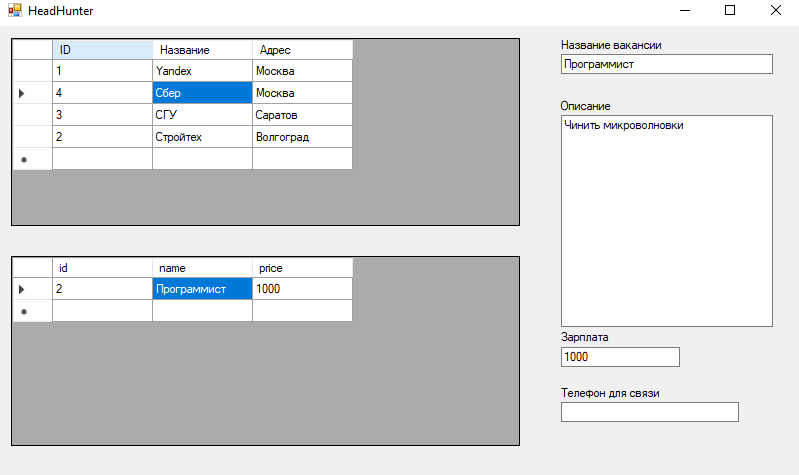
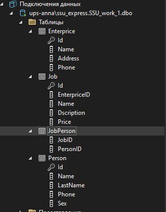

# Контрольная работа. Часть 1. C ШАРП И ADO

## Задание

База данных должна содержать информацию о предприятиях, готовых предоставить рабочее место по специальности или имеющих вакансии, полную информацию о безработном, его предпочтения, а также дату.

## Решение

```
CREATE TABLE [dbo].[Enterprice] (
    [Id]      INT            NOT NULL,
    [Name]    NVARCHAR (256) NOT NULL,
    [Address] NVARCHAR (256) NOT NULL,
    [Phone]   INT            NOT NULL,
    PRIMARY KEY CLUSTERED ([Id] ASC)
);
```

```
CREATE TABLE [dbo].[Job] (
    [Id]           INT            NOT NULL,
    [EnterpriceID] INT            NOT NULL,
    [Name]         NVARCHAR (256) NOT NULL,
    [Dscription]   NVARCHAR (MAX) NOT NULL,
    [Price]        INT            NULL,
    PRIMARY KEY CLUSTERED ([Id] ASC),
    CONSTRAINT [FK_JOB_ENTERPRICE] FOREIGN KEY ([EnterpriceID]) REFERENCES [dbo].[Enterprice] ([Id])
);
```

```
CREATE TABLE [dbo].[Person] (
    [Id]       INT            NOT NULL,
    [Name]     NVARCHAR (256) NOT NULL,
    [LastName] NVARCHAR (256) NOT NULL,
    [Phone]    INT            NOT NULL,
    [Sex]      CHAR (1)       DEFAULT ((1)) NULL,
    PRIMARY KEY CLUSTERED ([Id] ASC)
);
```

```
CREATE TABLE [dbo].[JobPerson]
(
	JobID int not null,
	PersonID int not null, 
    CONSTRAINT [FK_TO_PERSON] FOREIGN KEY ([PersonID]) REFERENCES [Person]([ID]),
	CONSTRAINT [FK_TO_JOB] FOREIGN KEY ([JobID]) REFERENCES [Job]([ID])
)
```

(Код формы)[Form1.cs]



